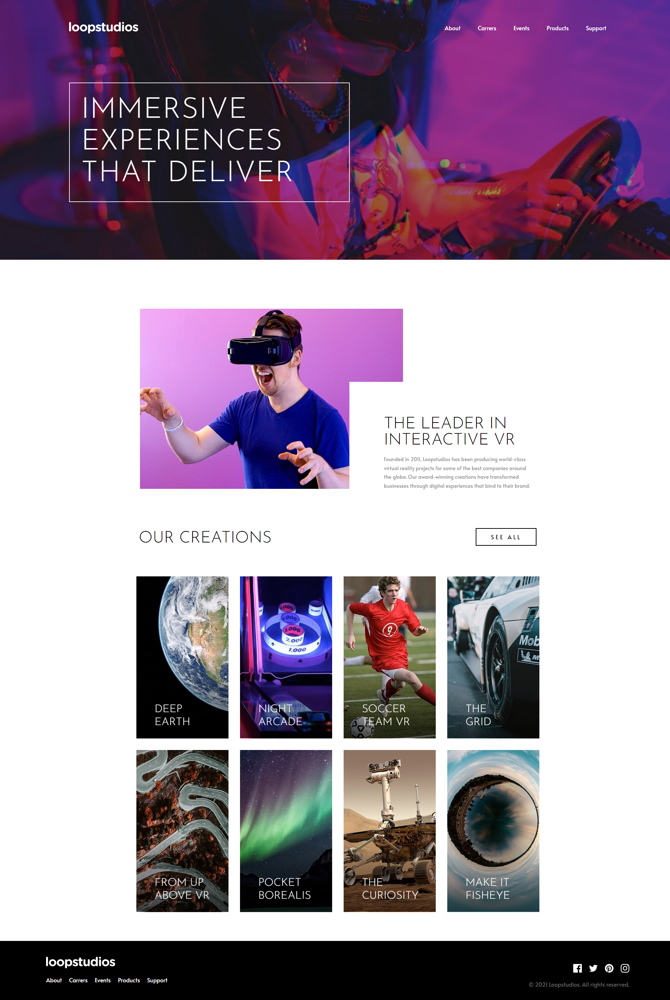
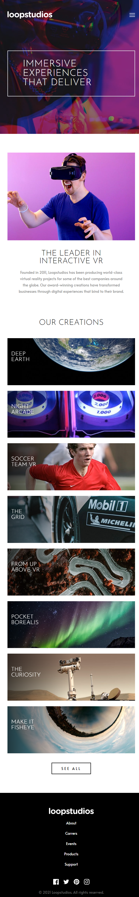

# Frontend Mentor - Loopstudios landing page solution

This is a solution to the [Loopstudios landing page challenge on Frontend Mentor](https://www.frontendmentor.io/challenges/loopstudios-landing-page-N88J5Onjw). Frontend Mentor challenges help you improve your coding skills by building realistic projects.

## Table of contents

- [Frontend Mentor - Loopstudios landing page solution](#frontend-mentor---loopstudios-landing-page-solution)
  - [Table of contents](#table-of-contents)
  - [Overview](#overview)
    - [The challenge](#the-challenge)
    - [Screenshot](#screenshot)
    - [Links](#links)
  - [My process](#my-process)
    - [Built with](#built-with)
    - [Useful resources](#useful-resources)
  - [Author](#author)

**Note: Delete this note and update the table of contents based on what sections you keep.**

## Overview

### The challenge

Users should be able to:

- View the optimal layout for the site depending on their device's screen size
- See hover states for all interactive elements on the page

### Screenshot

- Desktop Version:

- Mobile Version:

### Links

- Solution URL: [Github](https://github.com/TrEv0rRrRr/loopstudios-landing-page)
- Web page URL: [Web page](https://loopstudios-landing-page-trevor.netlify.app)

## My process

### Built with

- Semantic HTML5 markup
- CSS custom properties
- Flexbox
- CSS Grid
- Mobile-first workflow
- [Astro](https://astro.build) - Astro
- [Tailwind](https://tailwindcss.com) - Tailwind

### Useful resources

- [Tailwind Doc](https://tailwindcss.com/docs/installation) - Tailwind Documentation
- [Astro Doc](https://docs.astro.build/en/install-and-setup/) - Astro Documentation

## Author

- Frontend Mentor - [@TrEv0rRrRr](https://www.frontendmentor.io/profile/TrEv0rRrRr)
